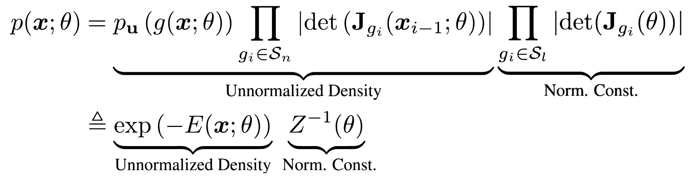

# Training Energy-Based Normalizing Flow with Score-Matching Objectives
[](https://arxiv.org/abs/2305.15267)
[](https://youtu.be/3IPZhTumzM0)

This repository contains the code implementation of the experiments presented in the paper [*Training Energy-Based Normalizing Flow with Score-Matching Objectives*](https://arxiv.org/abs/2305.15267).

<p align="center">
  
  
</p>

The project page is available at: <https://chen-hao-chao.github.io/ebflow/>

## Directory Structure
- Use the code in [ebflow/toy_examples](/toy_examples) to reproduce the results presented in **Sections 5.1 and A5**.
- Use the code in [ebflow/real_world](/real_world) to reproduce the results presented in **Sections 5.2, 5.3, and 5.4**.

## Dependencies

### (Optional) Launch a Docker Container

```sh
# assume the current directory is the root of this repository
docker run --rm -it --gpus all --ipc=host -v$(pwd):/app nvcr.io/nvidia/pytorch:20.12-py3
# inside the docker container, run:
cd /app
```

### Install Dependencies
Setup the conda environment with `conda_environment.yml`:
```sh
conda env create -f conda_environment.yml
```
Launch `ebflow` conda environment:
```sh
source activate
conda activate ebflow
```

## References

This code implementation is developed based on the following repositories:
- [taufikxu/FD-ScoreMatching](https://github.com/taufikxu/FD-ScoreMatching) (at commit 9df0789) is licensed under the MIT License.
- [akandykeller/SelfNormalizingFlows](https://github.com/akandykeller/SelfNormalizingFlows) (at commit 9feebb3) is licensed under the MIT License.
- [yang-song/score_sde_pytorch](https://github.com/yang-song/score_sde_pytorch) (at commit cb1f359) is licensed under the Apache-2.0 License.
- [ermongroup/sliced_score_matching](https://github.com/ermongroup/sliced_score_matching) (at commit 880c047) is licensed under the GPL-3.0 license.
- [kamenbliznashki/normalizing_flows](https://github.com/kamenbliznashki/normalizing_flows) (at commit 97a73a0).
- [fissoreg/relative-gradient-jacobian](https://github.com/fissoreg/relative-gradient-jacobian) (at commit d2e03ca).

## Citing EBFlow
If you find this code useful, please consider citing our paper.
```bib
@inproceedings{chao2023ebflow,
      title={{Training Energy-Based Normalizing Flow with Score-Matching Objectives}}, 
      author={Chen-Hao Chao and Wei-Fang Sun and Yen-Chang Hsu and Zsolt Kira and Chun-Yi Lee},
      year={2023},
      booktitle={Proceedings of International Conference on Neural Information Processing Systems (NeurIPS)}
}
```
