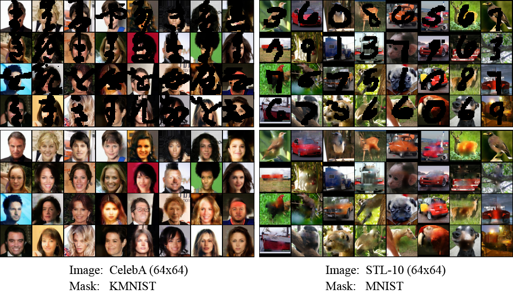

# Experiments on Real-World Datasets
This folder contains the code implementation of the experiments presented in Sections 5.2, 5.3 and 5.4 of the paper [*Training Energy-Based Normalizing Flow withScore-Matching Objectives*](https://arxiv.org/abs/2305.15267).



## Setup
Installing the `ebflow` package allows you to run experiments with the `ebflow` command. Conduct the following instruction at the root of this directory to initiate the installation:
```
pip install -e .
```

## Usage

### Training Process

Use commands with the following format to train a model:
```
ebflow --config {$(1)} --loss {$(2)} --restore_path {$(3)}
```
- (1) `config`: training configuration (format: `{dataset}_{architecture}`).
- (2) `loss`: objective function (i.e., `ml`, `sml`, `ssm`, `dsm`, `fdssm`).
- (3) `restore_path`: the path to a checkpoint form which the training process resumes.

#### Examples:
- **(Results in Table 2)** 
  - Train EBFlow on MNIST with the FC-based architecture and the SSM objective.
  ```
  ebflow --config 'mnist_fc' --loss 'ssm'
  ```
  - Train EBFlow on CIFAR-10 with the CNN-based architecture and the DSM objective.
  ```
  ebflow --config 'cifar_cnn' --loss 'dsm'
  ```

- **(Results in Table 4)** Train EBFlow on MNIST with the FC-based architecture and the SSM objective.
  ```
  ebflow --config 'mnist_fc' --loss 'ssm' --withoutMaP
  ```

- **(Results in Figure 4)**
  - Train EBFlow on MNIST with the Glow architecture and the SSM / DSM objective.
  ```
  ebflow --config 'mnist_glow' --loss 'ssm'
  ebflow --config 'mnist_glow' --loss 'dsm'
  ```
  - Generate samples using a pretrained Glow model.
  ```
  ebflow --config 'mnist_glow_inv' --restore_path 'results/mnist_glow_ssm/checkpoints/checkpoint_best.tar'
  ebflow --config 'mnist_glow_inv' --restore_path 'results/mnist_glow_dsm/checkpoints/checkpoint_best.tar'
  ```
  > The Glow model can be trained more efficiently through DSM without compromising the performance (in comparison to SSM).

- **(Results in Figure 5)**
  - Train EBFlow on CelebA / STL-10 with the FC-based architecture and the DSM objective.
    ```
    ebflow --config 'celeb_fc' --loss 'dsm'
    ebflow --config 'stl_fc' --loss 'dsm'
    ```
  - Perform inplainting using a pretrained FC-based model.
    ```
    ebflow --config 'celeb_fc_mcmc' --restore_path 'results/celeb_fc_dsm/checkpoints/checkpoint_best.tar' --loss 'dsm'
    ebflow --config 'stl_fc_mcmc' --restore_path 'results/stl_fc_dsm/checkpoints/checkpoint_best.tar' --loss 'dsm'
    ```
  > Use `--restore_path {path_to_checkpoint}` to resume the training from a prior checkpoint if the training accidentally terminates.
  
  > Download CelebA dataset through [\[link\]](https://mmlab.ie.cuhk.edu.hk/projects/CelebA.html).

### Details about the Code Implementation
- Models are built using the `FlowSequential` module (i.e. `ebflow/layers/flowsequential.py`). Each `FlowSequential` module contains a number of flow layers (i.e., `FlowLayer` and `LinearFlowLayer`), and has the following functions: *forward*, *reverse*, *log_prob*, *sample*.
- All of the flow layers belong to either `FlowLayer` or `LinearFlowLayer`. Layers with **constant Jacobians** are categorized as `LinearFlowLayer`, while the others are categorized as `FlowLayer`.
- The `Experiment` class (i.e., `ebflow/train/experiment.py`) handles training, evaluation, sampling, and checkpoint saving.
