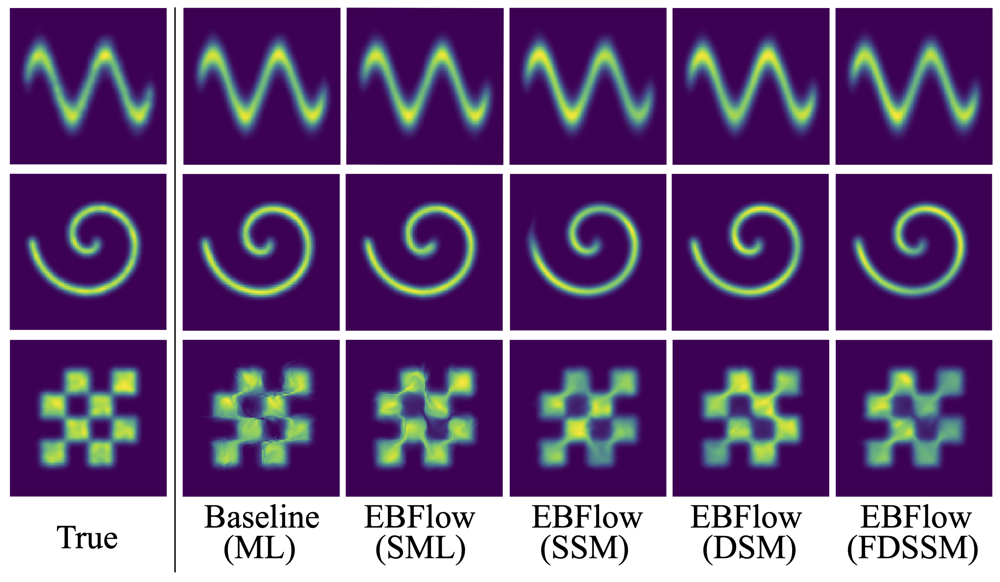

# Toy Experiments
This folder contains the code implementation of the toy experiments in Section 5.1 of the paper [*Training Energy-Based Normalizing Flow with Score-Matching Objectives*](https://arxiv.org/abs/2305.15267).



## Setup
Installing the `ebflow` package allows you to run experiments with the `ebflow` command. Conduct the following instruction at the root of this directory to initiate the installation:
```
pip install -e .
```

## Usage
Use commands with the following format to train a model:
```
ebflow --config {$(1)} --loss {$(2)} --dataset {$(3)} --Mtype {$(4)} --restore_path {$(5)}
```
- (1) `config`: training configuration (format: `{dataset}_{architecture}`).
- (2) `loss`: objective function in use (i.e., `ml`, `sml`, `ssm`, `dsm`, `fdssm`).
- (3) `dataset`: dataset in use (i.e., `sine`, `swirl`, `checkerboard`).
- (4) `Mtype`: matrix type in linear layers (i.e., `full`, `tril`, `triu`, `trilu`).
- (5) `restore_path`: the path to a checkpoint for evaluation.

#### Examples:
- **(Results in Table 1)** 
    - Train EBFlow on Sine with the SSM objective.
    ```
    ebflow --config 'twodim' --dataset 'sine' --loss 'ssm'
    ```
    - Train EBFlow on Checkerboard with the DSM objective.
    ```
    ebflow --config 'twodim' --dataset 'checkerboard' --loss 'dsm'
    ```
    - Evaluate the performance of the model with the checkpoint `results/dsm_sine/checkpoints/checkpoint_50000.pth` trained on Sine with the DSM objective.
    ```
    ebflow --config 'twodim' --dataset 'sine' --loss 'dsm' --eval --restore 'results/dsm_sine/checkpoints/checkpoint_50000.pth'
    ```

- **(Results in Figure A4)** 
    - Train a flow-based model constructed using unconstrained linear layers using samples drawn from a multimodal distribution.
    ```
    ebflow --config 'mm' --Mtype 'full'
    ```
    - Train a flow-based model constructed using linear layers with lower-triangular weight matrices using samples drawn from a multimodal distribution.
    ```
    ebflow --config 'mm' --Mtype 'tril'
    ```
    - Train a flow-based model constructed using linear layers with upper-triangular weight matrices using samples drawn from a multimodal distribution.
    ```
    ebflow --config 'mm' --Mtype 'triu'
    ```
    - Train a flow-based model constructed using linear layers with LU decomposition using samples drawn from a multimodal distribution.
    ```
    ebflow --config 'mm' --Mtype 'trilu'
    ```
